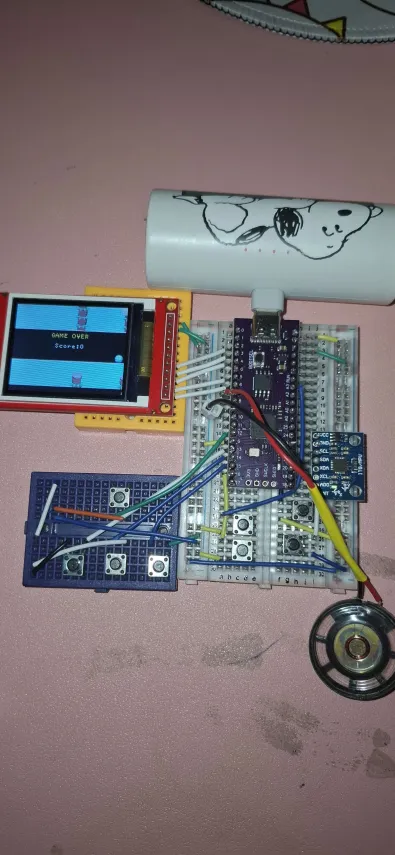

# makecode-arcade-rp2040

makecode arcade on rp2040.



Vedio:

https://github.com/user-attachments/assets/5abbc17d-cb16-4579-8219-a010cbccb1f9


## Config

This project is wire as this config:

``` config
# ACCELEROMETER
PIN_ACCELEROMETER_SCL = P_22
PIN_ACCELEROMETER_SDA = P_21
PIN_ACCELEROMETER_INT = P_20
ACCELEROMETER_TYPE = MPU6050

# Display
PIN_DISPLAY_CS = P_6
PIN_DISPLAY_DC = P_4
PIN_DISPLAY_MOSI = P_3
PIN_DISPLAY_RST = P_5
PIN_DISPLAY_SCK = P_2

# Audio
PIN_JACK_SND = P_7

# Change this madctl to fit your wire
DISPLAY_CFG0 = 0x80
DISPLAY_CFG1 = 0x603
DISPLAY_CFG2 = 0x16
DISPLAY_HEIGHT = 128
DISPLAY_TYPE = ST7735
DISPLAY_WIDTH = 160

# Button
PIN_BTN_A = P_18
PIN_BTN_B = P_19
PIN_BTN_MENU = P_16

PIN_BTN_LEFT = P_13
PIN_BTN_RIGHT = P_15
PIN_BTN_UP  = P_12
PIN_BTN_DOWN  = P_14
```

## Firmware

[arcade-rp2040-pico.uf2](arcade-rp2040-pico.uf2)

## External link

DIY your own board:
[https://microsoft.github.io/uf2/patcher/](https://microsoft.github.io/uf2/patcher/)
